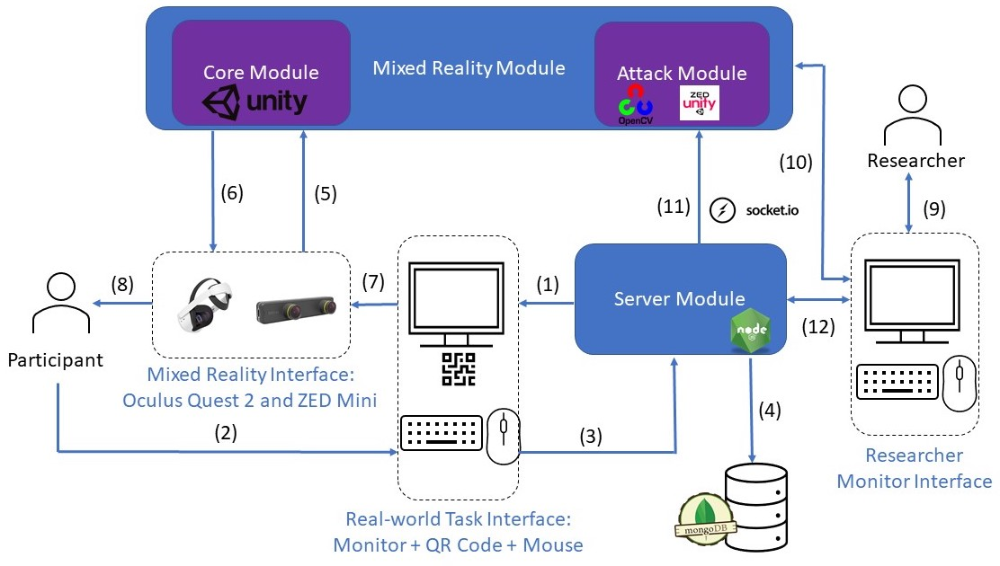

# MR-PMA-Harness

<<<<<<< Updated upstream
The repository contains the code for launching and capturing the impact of Perceptual Manipulation Attacks (PMA) in Mixed Reality on end users.
=======
The repository contains the code for launching and captureing the impact of Perceptual Manipulation Attacks (PMA) in Mixed Reality on end user. This project was tested on Windows 10. 
>>>>>>> Stashed changes

Further details can be found in the paper *"Exploring User Reactions and Mental Models Towards Perceptual Manipulation Attacks in Mixed Reality"* by Kaiming Cheng, Jeffery F. Tian, Tadayoshi Kohno, and Franziska Roesner.

If you end up building on this research or code as part of a project or publication, please include a reference to the USENIX Security paper.
```
@inproceedings{cheng2023pma,
    title = {Exploring User Reactions and Mental Models Towards Perceptual Manipulation Attacks in Mixed Reality},
    author = {Cheng, Kaiming and Tian, Jeffery F. and Kohno, Tadayoshi and Roesner, Franziska},
    booktitle = {32nd USENIX Security Symposium (USENIX Security 23)},
    year = {2023}
}
```


This is a project from the Security & Privacy Research Lab at the University of Washington. For more information about our other research projects in augmented- and mixed-reality security and privacy, see: https://ar-sec.cs.washington.edu/.




# Requirement 

## Hardware
We tested our code using [Oculus Quest 2](https://www.meta.com/quest/products/quest-2/) with a [ZED Mini camera](https://www.stereolabs.com/zed-mini/) attached. 

## Software

We tested our code in Unity Version 2019.4.12f1.
Our attack module is built on top of the [ZED Plugin for Unity](https://github.com/stereolabs/zed-unity). Please follow their instruction to install all necessary dependencies and load the plugin in your Unity.

# Materials

This repository contains the following materials:


## Nodejs code
- `Nodejs/server.js`: contains the code that we use to host Node.js server, and connects it to Unity
- `Nodejs/package.json`: contains the dependency we used for this project. Run `npm install` to install necessary packages.
- `Nodejs/public`: contains the code that we use for the experiment interface. Please start from the `index.html` page.
- `Nodejs/DB`: contains the code that we use for uploading result to MongoDB database. 
- `Nodejs/Socket_IO`: contains the code that we use for starting Socket.io connection.


## Unity & ZED
- `Unity\Asset`: contains the audio material we used in Auditory PMA.
- `Unity\MR_Scenes`: contains three unity scenes that maps to PMA experiment in the paper. 
- `Unity\Scripts\AudioManager`: contains the code we use to manage the Auditory PMA
- `Unity\Scripts\HandPresence`: contains the code we use to display the Situational Awareness Attack.
- `Unity\Scripts\MarkerObject_MoveToMarker`: contains the code we use to locate AR objects in Color PMA. 
- `Unity\Scripts\NetworkClient`: contains the code we use to connect Socket.io and sends out attack signal

## Contact
If you have any questions, feel free to contact Kaiming (kaimingc@cs.washington.edu) 

## Licensing
This code and data are covered by a modified BSD 3-Clause License which restricts the use of the code to academic purposes and which specifically prohibits commercial applications.

Any redistribution or use of this software must be limited to the purposes of non-commercial scientific research or non-commercial education. Any other use, in particular any use for commercial purposes, is prohibited. This includes, without limitation, incorporation in a commercial product, use in a commercial service, or production of other artefacts for commercial purposes.
